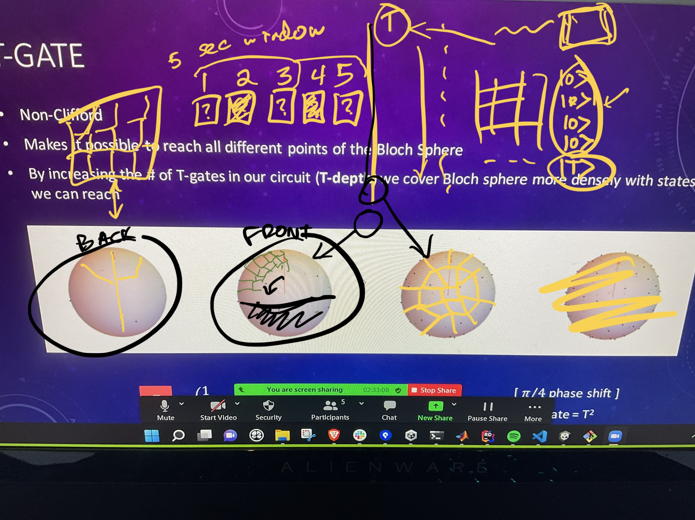

# ⚡⚡⚡ DisTilling Magic: NISQ's Revenge ⚡⚡⚡
### _Cover the Bloch Sphere before your T1 runs out! Look out for those coveted T gates!_

 
for the IonQ + Microsoft Joint Challenge @ MIT iQuHACK 2022!

  
  
  
  

## Play Now!
* Play on [binder](https://mybinder.org/v2/gh/amirebrahimi/2022_microsoft_ionq_challenge/main?filepath=game.ipynb)

OR

* Clone this repository and run [game.ipynb](game.ipynb)  
(requires qiskit, jupyterlab / notebooks, ipywidgets, etc.)

## Team
* Abhishek Manhas / [@AnakinPiwalker](https://github.com/AnakinPiwalker)
* Amir Ebrahimi / [@amirebrahimi](https://github.com/amirebrahimi)
* Jamie Gill / [@hegotgame](https://github.com/hegotgame)
* Mostafa Atallah / [@Mostafa-Atallah2020](https://github.com/Mostafa-Atallah2020)
* Syed Farhan / [@born-2learn](https://github.com/born-2learn)

In the past **26 hours** we've built a game to teach you about Clifford gates and universal gate sets along with magic states and their distillation. Our hope is that we'll teach you intuitively with a simple game to fill in the surface area of a sphere.

The fidelity of qubit operations is many orders of magnitude less reliable than classical bits. There are a couple of reasons for the infidelity such as gates being imperfect, incorrect readout measurements, qubit crosstalk, etc. The canonical algorithms -- Shor's, Grover's, etc. assume that given qubits are error-free (logical qubits). Running them on noisy, physical qubits won't produce a reasonable result. To ensure that we get our desired results i.e. without these errors, we need Quantum Error Correction (QEC).

While many are working in the field to produce as close to an error-free quantum computer as possible it is still likely that QEC will be required to enable fault tolerant computation. There are different approaches to QEC, one of which is known as the surface code, which we won't go into detail here about. The surface code encodes a logical qubit using many physical qubits. However, we generally can only produce logical gates from the Clifford group with ease while using the surface code. 

According to the Gottesman-Knill theorem, quantum computers that only make use of Clifford gates can be simulated on classical computers with polynomial overhead (i.e. efficiently). So, if those were the only gates we needed to use, then there would be _no need for an actual quantum computer_. In order to achieve universal quantum computation, a quantum computer must be able to perform operations beyond the Clifford set. The T gate is one such operation, which can complete the set. Here, we're going to discuss one of the ways to achieve universal quantum computation - The Bravyi & Kitaev solution via magic states and magic state distillation. The trick here is to create **magic states** that can be used as a resource to enact T-gate operations. In 2004, Bravyi & Kitaev demonstrate a method for purifying such states, given that they can already be prepared approximately. 

It involves using one of two type of states:  
* $|H\rangle = cos(\frac{\pi}{8})|0\rangle + sin(\frac{\pi}{8})|1\rangle$
* $|T\rangle = cos(\beta)|0\rangle + e^{\frac{i\pi}{4}}sin(\beta)|1\rangle$ where $\beta = \frac{1}{2}arccos(\frac{1}{\sqrt{3}})$

These magic states then get used in conjunction with a logical qubit to perform a non-Clifford gate operation. More information is in the original paper from Bravyi & Kitaev.

Because we can't rely on our noisy quantum computers to produce these states fault tolerantly it is necessary to _distill_ purer states. Enter: **magic state distillation**. 

As described on Wikipedia, the method of distillation is as follows:
* **Input**: Prepare 5 imperfect states.
* **Output**: An almost pure state having a small error probability.
* **repeat**
    * Apply the decoding operation of the [Five-qubit error-correcting code](https://en.wikipedia.org/wiki/Five-qubit_error_correcting_code) and measure the syndrome.
    * **If** the measured syndrome is $|0000\rangle$, the distillation attempt is successful.
    * **else** Get rid of the resulting state and restart the algorithm.
* **until** The states have been distilled to the desired purity.

We have implemented this protocol in the following notebook: [qiskit_distillation.ipynb](qiskit_distillation.ipynb)

Experimentally, we ran this on a real IonQ quantum computer, [collected the results](ionq_qpu_real_data.ipynb), and used this real data in our game to control when T gates appear.

### Conclusion

Hackathons are intense. A few of us slept very little. We all learned an incredible amount in a short period of time. Overall, we achieved creating a novel game and introducing concepts to the game player about how universal quantum computation works. And it all started from this lengthy, bullet-proof detailed design document 😎:

    
### Resources
* [Clifford gates](https://en.wikipedia.org/wiki/Clifford_gates)
* [Gottesman-Knill theorem](https://en.wikipedia.org/wiki/Gottesman%E2%80%93Knill_theorem)
* [Magic State Distillation](https://en.wikipedia.org/wiki/Magic_state_distillation)
* [Quantum Error Correction using Repetition Codes - Part 1 by James R. Wootton](https://qiskit.org/learn/intro-qc-qh)
* [IQC Magic States by Nathan Babock](https://www.iqst.ca/events/csqic05/talks/nathan%20b.pdf)
* [Original paper by Bravyi & Kitaev](https://arxiv.org/pdf/quant-ph/0403025.pdf)